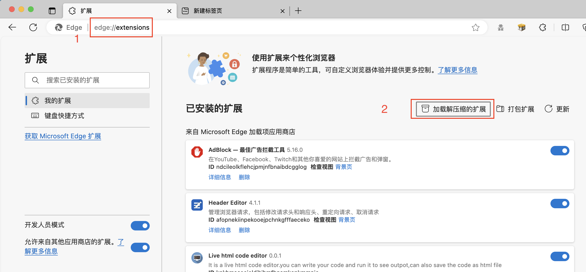
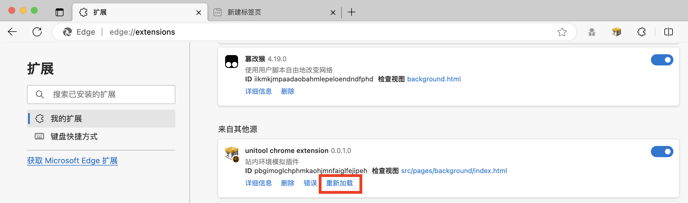

<h1> 涨乐开发环境模拟插件 </h1>

## Intro
针对涨乐业务开发中环境与标准浏览器不一致的问题提供的模拟插件，目前支持的功能有：
- 模拟站内环境
  - Android
  - iOS
- 模拟三方展业环境（待开发）

## Features 
- [站内Bridge模拟]
  - [Android]()
  - [iOS]()
- [站内action模拟]()
- [站内读写能力模拟]()

## Installation 
chrome或edge浏览器通过开发者模式加载插件包
firefox未经测试

### Procedure
1. 打开浏览器扩展程序页面
2. 配置启用插件的url匹配规则，或者套用我们提供的预设规则
3. 插件会自动加载预设的action plugins，如果需要自定义action plugin，可以在插件配置页面进行配置
4. 配置需要使用的本地变量
5. 检查当前window对象是否有`window.HTJSBridge`(iOS)或`window.MyWebView`(Android)变量，如果有代表插件已经正常工作

### Development
1. clone本项目
2. Yarn安装依赖
3. yarn dev启动调试模式
4. 通过浏览器扩展程序页面加载本项目的dist目录

   

5. 修改代码之后在浏览器扩展程序页面重新加载插件即可

   

## Release
1. yarn build
2. 上传到git服务器
